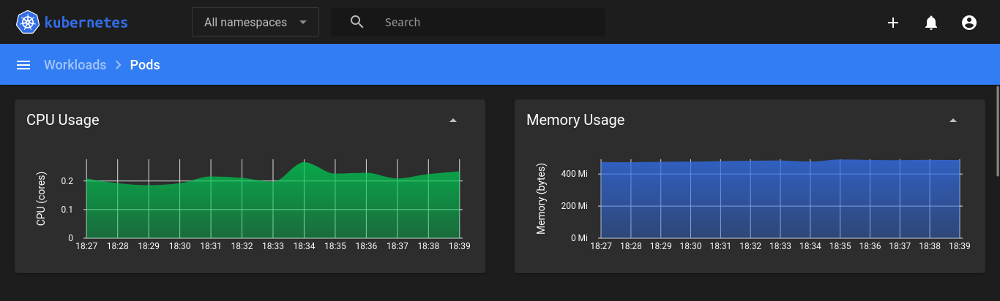
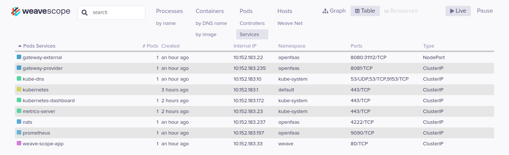
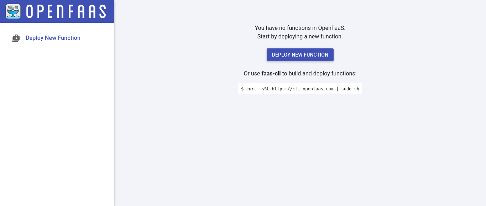
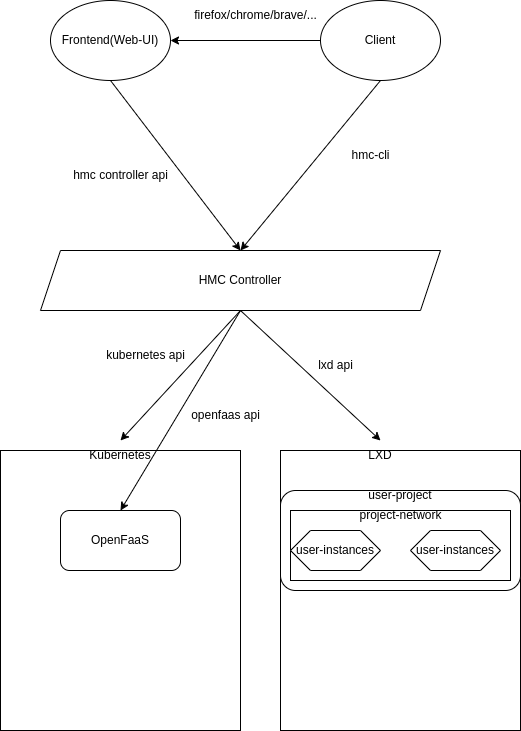

# HiveCloud microcloud

As a (fake) cloud company we provide some services services proposed by the [CNCF](https://landscape.cncf.io/) like OpenFaaS, Kubernetes, LXC containers, and more.

Here is the documentation of what we deployed.

# Kubernetes

Because we work on single node we chose to use `microk8s` as our kubernetes distribution thanks to it simplicity and scalability.

## Deploy microk8s

Install the package:

`sudo snap install microk8s --classic`

Enable the required services:

`microk8s enable dashboard dns registry istio`

And verify the availability

`microk8s status`

## Accessing the dashboard

As enabled previously we can now access the kubernetes dashboard:

`microk8s dashboard-proxy`



## Deploy weave scope

To have a better view of our kubernetes cluster we use `weave scope` to monitor our services and pods.

weave scope helps us get a better tracability on our infrastructure.

Deploy weave scope:

`kubectl apply -f ./manifests/weave.yml`



# OpenFaaS

Our users don't always need VM or containers. Sometimes they just want to run some functions!
So we decided to use `OpenFaaS` and set it on top of our `k8s` node.

## Installation

First, we need to create the namespaces for openfaas:

`kubectl apply -f ./manifests/openfaas-ns.yml`

Then add `OpenFaaS` repo to helm:

`helm repo add openfaas https://openfaas.github.io/faas-netes/`

And deploy `OpenFaas`:

```bash
helm repo update \
 && helm upgrade openfaas --install openfaas/openfaas \
    --namespace openfaas  \
    --set functionNamespace=openfaas-fn \
    --set generateBasicAuth=true
```

## Access

Now that `OpenFaaS` is installed we can now acces its dashboard:



# LXD

We want to provide IaaS to our clients and we choose `LXD` for this.

`LXD` is a wrapper for `LXC` made to provide an API and more advanced featrues.

## Installation

Here we are going to install `LXD` and `OVN` to provide Virtual Networks to our users.

### Setup LXD

Install the package:

`sudo snap install lxd --channel=latest/stable`

P.S. We recommand building lxd from sources...

Configure LXD:

`sudo lxd init`

Output:

```
Would you like to use LXD clustering? (yes/no) [default=no]: yes
What IP address or DNS name should be used to reach this server? [default=192.168.2.100]: 127.0.0.1
Are you joining an existing cluster? (yes/no) [default=no]: no
What member name should be used to identify this server in the cluster? [default=pop-os]: microcloud
Setup password authentication on the cluster? (yes/no) [default=no]: no
Do you want to configure a new local storage pool? (yes/no) [default=yes]: yes
Name of the storage backend to use (dir, lvm, btrfs) [default=btrfs]: dir
Do you want to configure a new remote storage pool? (yes/no) [default=no]: no
Would you like to connect to a MAAS server? (yes/no) [default=no]: no
Would you like to configure LXD to use an existing bridge or host interface? (yes/no) [default=no]: no
Would you like stale cached images to be updated automatically? (yes/no) [default=yes]: 
Would you like a YAML "lxd init" preseed to be printed? (yes/no) [default=no]: 
```

### Setup OVN

Install the packages:

`sudo apt install ovn-host ovn-central`

Configure OVN:

```bash
sudo ovs-vsctl set open_vswitch . \
   external_ids:ovn-remote=unix:/var/run/ovn/ovnsb_db.sock \
   external_ids:ovn-encap-type=geneve \
   external_ids:ovn-encap-ip=127.0.0.1
```

## Network setup

Now that we installed `LXD` and `OVN` we now need to setup our SDN(Software Defined Networks).

First we need to create a BRIDGE network:

`lxc network create BRIDGE --type bridge`

And then out OVN main network:

```bash
lxc network create UPLINK --type=physical parent=BRIDGE\
   ipv4.ovn.ranges=<BRIDGE_IP_range> \
   ipv4.gateway=<BRIDGE_network_gateway> \
   dns.nameservers=<name_server>
```
The parameter `ipv4.gateway` specifies the CIDR used by network `UPLINK`

`ipv4.ovn.ranges` specifies the usable WAN IPs for our users SDNs.

We are now able to create SDNs for our client (here up to 253 SDNs)

# MicroCloud controller

Now that we setted up everything we need for our cloud, we need to create a controller that will be used as a gateway between the users and the infrastructure.




You can find the controller at https://github.com/hivecloud-iris/hmc-controller